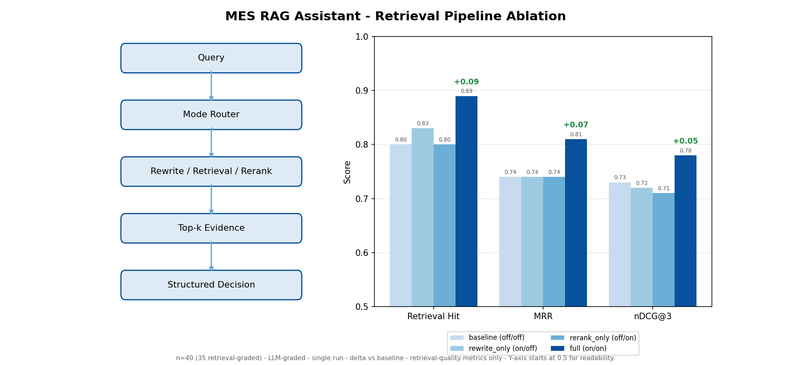
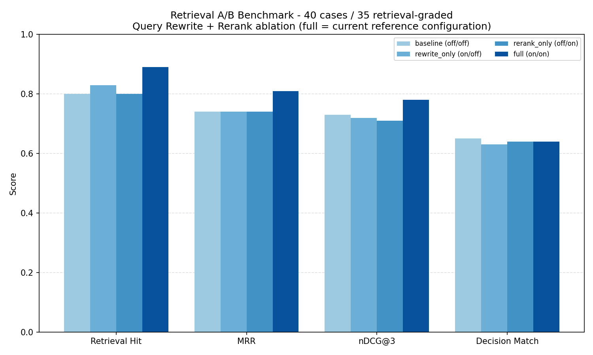

# MES RAG Assistant

RAG/LLM-based decision core for semiconductor manufacturing — retrieves domain knowledge and returns structured engineering decisions.



## What It Does

Given an anomaly description or engineering question, the system:

1. **Retrieves** relevant knowledge from curated SOP / FMEA / FAQ documents via ChromaDB vector search
2. **Augments** context with historical anomaly cases (memory layer)
3. **Reasons** over combined context using Gemini or OpenAI
4. **Returns** a structured JSON decision (`MESAnalysisOutput`) with root cause, recommended actions, confidence, and trust scoring

This repo is the **decision brain** of the FAB AI Copilot system. It does not own dashboards, pipelines, or notifications — it produces decisions that other systems act on.

## Architecture

```
User Query
    │
    ▼
┌─────────────────────────────────────────┐
│  Query Rewrite (heuristic expansion)    │
│  → expands abbreviations + domain terms │
└────────────────┬────────────────────────┘
                 │
    ┌────────────▼────────────┐
    │   Query Classifier      │
    │  (case / sop / general) │
    └────────────┬────────────┘
                 │
    ┌────────────▼────────────┐
    │   Decision Router       │
    │  memory → rag → llm     │
    └────┬──────┬──────┬──────┘
         │      │      │
    ┌────▼──┐ ┌─▼───┐ ┌▼────┐
    │Memory │ │ RAG │ │ LLM │
    │Store  │ │Chroma│ │Only │
    └───┬───┘ └──┬──┘ └──┬──┘
        └────────┼───────┘
                 │
    ┌────────────▼────────────┐
    │  Token-Overlap Reranker │
    └────────────┬────────────┘
                 │
    ┌────────────▼────────────┐
    │  LLM Chain              │
    │  (Gemini / OpenAI)      │
    └────────────┬────────────┘
                 │
    ┌────────────▼────────────┐
    │  Structured Output      │
    │  MESAnalysisOutput      │
    │  + Trust Score           │
    │  + Evidence Sources      │
    └─────────────────────────┘
```

## Key Features

| Feature | Description |
|---------|-------------|
| Multi-Query RAG | LangChain + ChromaDB over `rag_data/*.md` with multilingual embeddings (Chinese + English) |
| Memory Layer | 5-seed historical anomaly case store with keyword-token overlap matching |
| Structured Output | Pydantic-validated `MESAnalysisOutput` with retry on parse failure |
| Decision Router | Heuristic query classifier → memory / rag / llm routing |
| Query Rewrite | Domain vocabulary expansion for semiconductor terms |
| Hallucination Control | `evidence_sources`, `confidence_reason`, `uncertainty_flag` |
| Trust Scoring | Composite trust score (0–1) based on memory hit, route, provider |
| Retrieval Rerank | Token-overlap reranker with `top_sources` debug signals |
| Evaluation Framework | 40-case / 4-mode A/B benchmark (`eval/run_eval.py`) |
| Provider Routing | Gemini primary / OpenAI fallback with automatic failover |

## Project Structure

```
mes-rag-assistant/
├── app.py                    # Main application (Gradio + all chains)
├── requirements.txt
├── .env.example              # Required environment variables
├── rag_data/                 # Knowledge base documents
│   ├── 01_異常類型定義.md
│   ├── 02_SOP_異常處置流程.md
│   ├── 03_AI_Copilot判斷邏輯.md
│   └── 04_設備常見問題集.md
├── memory/
│   └── memory_store.json     # Historical anomaly cases
├── eval/
│   ├── run_eval.py           # Evaluation harness
│   ├── run_baseline_check.py # G4 regression gate (compares against baseline)
│   ├── eval_cases.json       # 40 labeled test cases
│   ├── eval_results.json     # Latest single-mode eval output
│   └── eval_ab_results.json  # 4-mode A/B comparison results
├── ARCHITECTURE.md           # Integration boundaries
├── AI_ROADMAP.md             # Development roadmap
└── CHANGELOG.md              # Phase-by-phase changelog
```

## Quick Start

```bash
# Clone
git clone https://github.com/b10116006-art/mes-rag-assistant.git
cd mes-rag-assistant

# Install dependencies
pip install -r requirements.txt

# Configure environment
cp .env.example .env
# Edit .env — add at least one LLM provider key (Gemini or OpenAI)

# Run
python app.py
# Opens Gradio UI at http://localhost:7860
```

## Evaluation

The eval framework benchmarks retrieval quality and decision accuracy across 4 modes:

```bash
cd eval
python run_eval.py
```

| Mode | Query Rewrite | Rerank | Purpose |
|------|:---:|:---:|---------|
| baseline | off | off | Control group |
| rewrite_only | on | off | Rewrite contribution |
| rerank_only | off | on | Rerank contribution |
| full | on | on | Production behavior |

**Tracked metrics:** `anomaly_type_accuracy`, `retrieval_hit_rate`, `top_k_hit_rate`, `avg_source_overlap`

Results are committed in `eval/eval_ab_results.json` for full reproducibility. Run `python eval/run_eval.py` to verify against your own LLM provider.

### Benchmark Snapshot

Frozen reference from the committed full-mode run (`eval/baseline_metrics.json`) —
**40 cases / 35 retrieval-graded**. This snapshot is the G4 regression baseline.

| Mode | Rewrite | Rerank | Retrieval Hit | MRR | nDCG@3 | Decision Match |
|------|:---:|:---:|:---:|:---:|:---:|:---:|
| baseline | off | off | 0.80 | 0.74 | 0.73 | 0.65 |
| rewrite_only | on | off | 0.83 | 0.74 | 0.72 | 0.63 |
| rerank_only | off | on | 0.80 | 0.74 | 0.71 | 0.64 |
| **full** | **on** | **on** | **0.89** | **0.81** | **0.78** | **0.64** |

`full` (rewrite + rerank) is the current reference configuration used by the frozen G4 baseline.
Metrics are LLM-graded and provider-dependent — reproduce with `python eval/run_eval.py`.



> **Note:** Current benchmark is 40 cases (35 graded). The harness is designed for regression detection across controlled diffs. See `AI_ROADMAP.md` Phase 6.6 for scope and limitations.

## Development Status

| Phase | Name | Status |
|-------|------|--------|
| 0 | Repo Foundation | ✅ Implemented |
| 1 | Memory-based RAG | ✅ Implemented |
| 2 | Structured Decision Output | ✅ Implemented |
| 3 | Context Orchestrator / Router | ✅ Implemented |
| 4 | Evaluation Layer (MVP → 40-case) | ✅ Implemented |
| 4.5 | Hallucination Control | ✅ Implemented |
| 4.6 | Query Rewrite | ✅ Implemented |
| 5 | Trust Scoring | ✅ Implemented |
| 6 | Retrieval Rerank | ✅ Implemented |
| 6.5 | Retrieval Evaluation Metrics | ✅ Implemented |
| 6.6 | Retrieval A/B Measurement | ✅ Implemented |
| 6.7 | Deep Retrieval Metrics (MRR + nDCG@3) | ✅ Implemented |
| 6.8 | Benchmark Expansion (10 → 40 cases) | ✅ Implemented |
| G4 | Baseline Regression Gate | 🔧 In Progress |
| 7 | Cloud-ready FastAPI Serving | 📋 Planned |

See [AI_ROADMAP.md](AI_ROADMAP.md) for full phase details and dependency-aware execution sequence.

## Tech Stack

- **LLM:** Google Gemini 2.5 Flash (primary) / OpenAI GPT-4o (fallback)
- **Embeddings:** `sentence-transformers/paraphrase-multilingual-MiniLM-L12-v2` (Chinese + English)
- **Vector Store:** ChromaDB
- **Framework:** LangChain + Gradio
- **Validation:** Pydantic v2

## Related Projects

- [AOI Defect Triage](https://github.com/b10116006-art/AOI_Defect_Triage_v1) — CNN + YOLO defect classification system (future evidence input to this RAG system)
